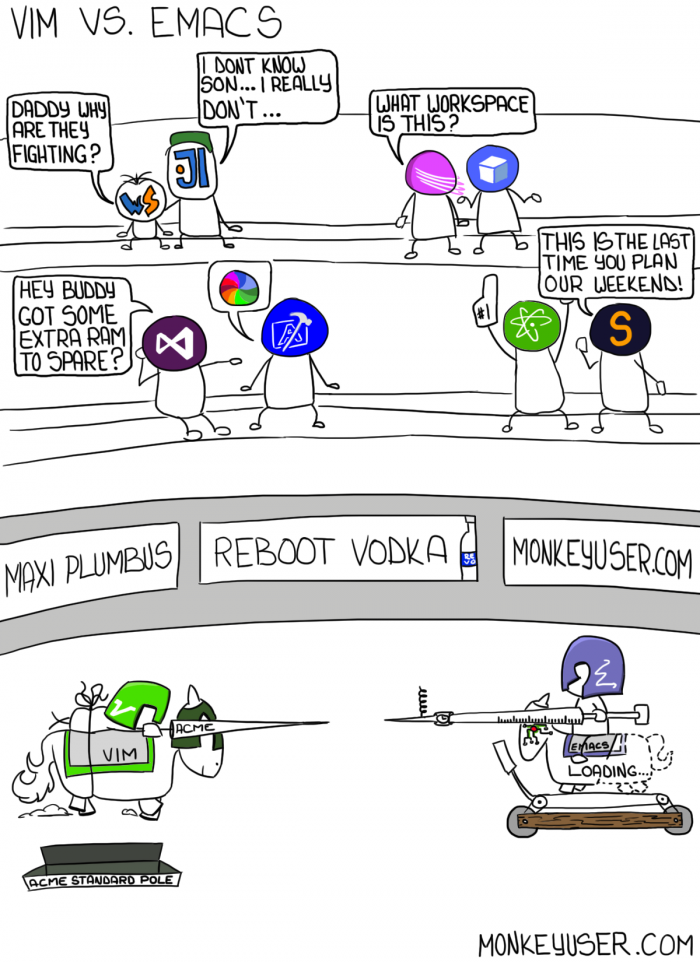
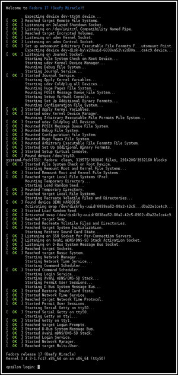

# workshop.introGnu-LInux
En este workshop veremos una breve introducción a Linux desde una perspectiva del mundo del desarrollo de software

# El kernel **La pieza más importante**
El [kernel](https://www.redhat.com/es/topics/linux/what-is-the-linux-kernel) es la unidad más importante de los sistemas operativos Linux, este mismo funciona como
puente entre el hardware de la computadora y sus procesos.

El kernel cumple 4 tareas:
* Gestión de memoria.
* Gestión de procesos.
* Controlador de dispositivos.
* Seguridad y llamadas al sistema.

# Aplicaciones reales
Las aplicaciones reales en Linux más notables es en el uso de servidores, tanto enterprise como desarrollo en general, esto se debe a su gran facilidad de
configuración y rendimiento que son óptimos para mantener sistemas y aplicaciones. [Lee más aquí](https://www.opensourceforu.com/2020/03/reasons-to-use-linux/)

# Distribuciones
En el mundo de Gnu/Linux existen [distribuciones](https://www.gnu.org/distros/) que podemos elegir entre toda una serie de otras que ofrecen ciertas características
ya sean para los usuarios como para las empresas, tal es el caso de [RHEL](https://www.redhat.com/en/technologies/linux-platforms/enterprise-linux)


# Diferenicas entre Shell, Terminal y Consola
Ahora vamos a entrar en una de las grandes confunsiones entre Terminal,Shell y Consola, la [diferencia](https://www.futurehosting.com/blog/linux-basics-terminal-shell-console-what-is-the-difference/) radica específicamente en que la shell funciona entre intermediario del [OS](https://en.wikipedia.org/wiki/Operating_system) \*Ver figura No.1\* y la terminal entonces es la interfaz gráfica que nos brinda interacción.


Figura No.1

# Conectandonos a la maquina virtual
```
> Con SSH
$ ssh usuario@host
> Usando una llave
$ ssh -i /dirección/llave usuario@host
```

# ¿Qué carajos es la nube?
La nube también genera mucha confusión, pero no más que un simple computador conectado a internet en pocas palabras. [Más acá](https://www.linux.com/news/linux-platform-cloud/)


# Entrando con los comandos básicos en Linux
* ls

Lista los archivos dado un directorio dado
```
ls [opciones] [fichero...]
-------------------------
$ ls
$ ls -l
$ ls -la
```

* touch

Crea un archivo pasado como argumento, aunque también cambia la fecha de acceso y/o modificación del archivo especificado.
```
touch archivo...
-----------------
$ touch foo
$ touch bar
$ touch misNotas.txt
$ touch main.c
```

* mkdir

Crea directorios con los nombres especificados
```
mkdir directorio...
---------------------------------
$ mkdir folder
```


* cd

Cambia el directorio actual a un directio dado
```
cd directorio
---------------------------------
$ cd
$ cd directorio/
$ cd /etc
```


* pwd

Imprime el directorio actual
```
pwd
--------------
$ pwd
```


* mv

Mueve O renombra ficheros
```
mv [opcion] origen destino
-----------------------------
# renombrando
$ mv file renamedFile

# Moviendo
$ mv file ~/

# Remplazando
# Argumento -i Pide confirmacion si existe el archivo
$ mv -i file directory/file

```

* cp

Copia ficheros y directorios
```
cp [opciones] fichero directorio
----------------------------------
# Copiando archivos
$ cp file ~/myDirectory/

# Copiano directorios
# Argumento -r quiere decir: Copiar de manera recursiva
$ cp -r directory/ ~/
```


* man

Manual de referencia del sistema
```
man [opciones] pagina
-----------------------
# What is?
$ man -f mv

$ man man

$ man mv
```

# Manejadores de paquetes
Un [manejador de paquetes](https://en.wikipedia.org/wiki/Package_manager) es todo un conjunto de herramientas que permiten facilitar 
el proceso de instalación, configuración, actualización y eliminación de paquetes de software, el manejador de paquetes se ocupa 
también de las distribuciones del software instalado. Los paquetes contienen metadata como nombre del software, la versión y 
el numero (y cuales) de dependencias que éste ocupa.

### yum
Yum es un instalador de paquetes para sistemas rpm. Dado que vamos a trabajar con Amazon Linux 2, este sistema esta basado en un 
[RHEL](https://en.wikipedia.org/wiki/Red_Hat_Enterprise_Linux) y a su vez proporciona RPM

[Lea más acá](https://www.redhat.com/sysadmin/how-manage-packages)

# Instalando paquetes

Instalando VIM
```
$ sudo amazon-linux-extras list
$ sudo amazon-linux-extras list | grep vim
$ yum clean metadata
$ sudo yum install -y vim-minimal

# Ya tenemos nuestro paquete instalado, lo mandamos a llamar.
$ vim
```

# Editores de terminal
Se han preguntado: ¿Cómo rayos editamos archivos en una terminal? Bueno la respuesta es sencilla y esta en los editores basados en la terminal. Existen una
gran variedad de estos mismos, uno de los más famosos y conocidos es vim, nano o emacs, y de hecho, hay una pelea entre los ultimos dos sobre cuál es el mejor.
¡¡¡VIM FTW!!!!

[vim](https://www.vim.org/) [nano](https://www.nano-editor.org/) [emacs](https://www.gnu.org/software/emacs/)


# Editando archivos desde la terminal

Como habíamos dicho anteriormente existen editores de terminal y a continuación vamos a ver como editar de manera sencilla un archivo utilizando VIM.
Primero que nada debemos llamar a nuestro editor de texto con el comando 

``` $ vim ```

Hay dos formas (en realidad más) para poder editar un archivo con vim. La primera forma que utilizaremos será creando un archivo con touch y luego
llamándolo con vim:

```
$ touch notas.txt
$ vim notas.txt
```

La segunda forma es creando el archivo si no existe desde vim, el editor se encargará de crearlo cuando nosotros guardemos:

```
$ vim notas.txt
```

Una ves hemos hecho esto debemos saber que en vim hay diferentes modos en los que podemos estar, para entrar en el modo escritura presionaremos la letra
*i* y de esta manera podemos empezar a escribir en nuestro archivo, una vez hayamos terminado de escribir podemos presionar la tecla de *Esc* para salir
al modo normal. Ahora para guardar nuestros cambios hay que ejecutar algunas funciones del editor, las cuales son *:w* que significa write para guardar, 
al presionar los dos puntos estamos diciendo al editor que vamos a ejecutar una funciona por lo que se nos desplega una barra inferior para la misma, para 
salir una vez hayamos guardado vamos a ejecutar *:q*. Pro-tip: Puedes simplemente escribir *:wq* para guardar y salir.

Para cortar, copiar y pegar dentro de vim es muy sencillo, primero que nada debemos colocarnos en el modo normal, luego para cortar una linea entera
podemos presionar: *dd*, para pegar lo que anteriormente cortamos simplemente presionamos: *p*, ahora para copiar y pegar el procedimiento es otro, primero
debemos irnos al modo visual que se consigue presionando *v* y seleccionando nuestra área para copiar, una vez hayamos realizado esto debemos presionar *y*
y para pegar es el mismo proceso anterior mencionado el cual consiste en presionar *p*

*Para más ayuda presiona :help en vim*

[vim cheat sheet](http://vimsheet.com/)



# Arbol de directorios

``` 
1.- / 

2.- /bin /sbin

3.- /dev

4.- /etc

5.- /home
```

Vamos a hablar ahora de una de las piezas importantes en Linux la cual es la estructura de directorios, de forma numérica vamos a ver algunos de ellos.

1.- **ROOT**

Todos los archivos en Linux están sobre el directorio 'root' que esta sobre:  ``` / ``` , por lo que podemos decir que es el directorio raíz.

3.- **BIN/SBIN**

En ``` /bin ``` y ``` /sbin ``` se encuentran todos los binarios, en bin están los binarios como *cat, cd, echo, etc...* y en sbin binarios para tareas del OS.

4.- **ETC**

En ``` /etc ``` podemos encontrar todos los archivos de configuración del sistema aunque también contendrá los archivos de aplicaciones que instalemos
en un futuro.

5.- **HOME**

Home es el directorio que por estándar tienen los usuarios y su función es guardar todos los archivos de los mismos, dentro de ``` /home ``` están los 
directorios personales de los usuarios, por ejemplo:

```
/home/pepito
/home/juanita
```


Más acá: [Inglés](https://linuxhandbook.com/linux-directory-structure/) [Español](https://computernewage.com/2015/06/14/el-arbol-de-directorios-de-linux-al-detalle-que-contiene-cada-carpeta/)

# Systemd

[Del sitio de systemd](https://systemd.io/)
> systemd is a suite of basic building blocks for a Linux system. It provides a system and service manager that runs as 
> PID 1 and starts the rest of the system.
> systemd provides aggressive parallelization capabilities, uses socket and D-Bus activation for starting services, offers on-demand 
> starting of daemons, keeps track of processes using Linux control groups, maintains mount and automount points, and implements an 
> elaborate transactional dependency-based service control logic. systemd supports SysV and LSB init scripts and works as a replacement for sysvinit.


En pocas palabras trata de unificar confifuracion y los servicios en todas las distribuciones de Linux y el componente principal de systemd es un 
administrador de sistemas y servicios.



[Wikipedia](https://en.wikipedia.org/wiki/Systemd)

# Daemon

Un daemon es un programa que corre como un proceso por debajo *background process* en ves de estar en el control directo del usuario. Tradicionalmente
el nombre de los procesos de los deamons terminan con la letra *d*, esto se hace para diferenciar entre los mismos y programas normales corriendo, también
para saber que se trata de un deamon en realidad.


> Components of some Linux desktop environments that are daemons include D-Bus, NetworkManager (here called unetwork), PulseAudio (usound), and Avahi. [wikipedia](https://en.wikipedia.org/wiki/Daemon_(computing))

# Instalanado NGINX
* Listando los extras de amazon-linux, en este caso nginx

``` $ sudo amazon-linux-extras list | grep nginx ```

* Habilitando los extras de amazon-linux de nginx

``` $ sudo amazon-linux-extras enable nginx1  ```

* Limpiando la metadata

``` $ sudo yum clean metadata ```

* Instalando

``` $ sudo yum -y install nginx ```

# Corriendo servicio de NGINX
* Mirando el estado actual

``` $ sudo systemctl status nginx ```

* Iniciando el servicio

``` $ sudo systemctl start nginx ```

# Editando el archivo principal de NGINX

``` 
$ vim /etc/nginx/nginx.conf
$ sudo vim /usr/share/nginx/html/index.html
$ sudo systemctl restart nginx.service
```

# GRACIAS!