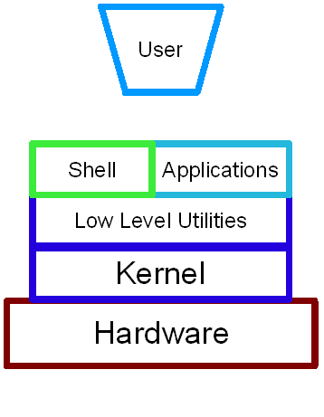

# workshop.introGnu-LInux
En este workshop veremos una breve introducción a Linux desde una perspectiva del mundo del desarrollo de software

# El kernel **La pieza más importante**
El [kernel](https://www.redhat.com/es/topics/linux/what-is-the-linux-kernel) es la unidad más importante de los sistemas operativos Linux, este mismo funciona como
puente entre el hardware de la computadora y sus procesos.

El kernel cumple 4 tareas:
* Gestión de memoria.
* Gestión de procesos.
* Controlador de dispositivos.
* Seguridad y llamadas al sistema.

# Aplicaciones reales
Las aplicaciones reales en Linux más notables es en el uso de servidores, tanto enterprise como desarrollo en general, esto se debe a su gran facilidad de
configuración y rendimiento que son óptimos para mantener sistemas y aplicaciones. [Lee más aquí](https://www.opensourceforu.com/2020/03/reasons-to-use-linux/)

# Distribuciones
En el mundo de Gnu/Linux existen [distribuciones](https://www.gnu.org/distros/) que podemos elegir entre toda una serie de otras que ofrecen ciertas características
ya sean para los usuarios como para las empresas, tal es el caso de [RHEL](https://www.redhat.com/en/technologies/linux-platforms/enterprise-linux)


# Diferenicas entre Shell, Terminal y Consola
Ahora vamos a entrar en una de las grandes confunsiones entre Terminal,Shell y Consola, la [diferencia](https://www.futurehosting.com/blog/linux-basics-terminal-shell-console-what-is-the-difference/) radica específicamente en que la shell funciona entre intermediario del [OS](https://en.wikipedia.org/wiki/Operating_system) \*Ver figura No.1\* y la terminal entonces es la interfaz gráfica que nos brinda interacción.


Figura No.1

# Conectandonos a la maquina virtual
```
> Con SSH
$ ssh usuario@host
> Usando una llave
$ ssh -i /dirección/llave usuario@host
```

# ¿Qué carajos es la nube?
La nube también genera mucha confusión, pero no más que un simple computador conectado a internet en pocas palabras. [Más acá](https://www.linux.com/news/linux-platform-cloud/)


# Entrando con los comandos básicos en Linux
* ls
* touch
* mkdir
* cd
* pwd
* mv
* cp
